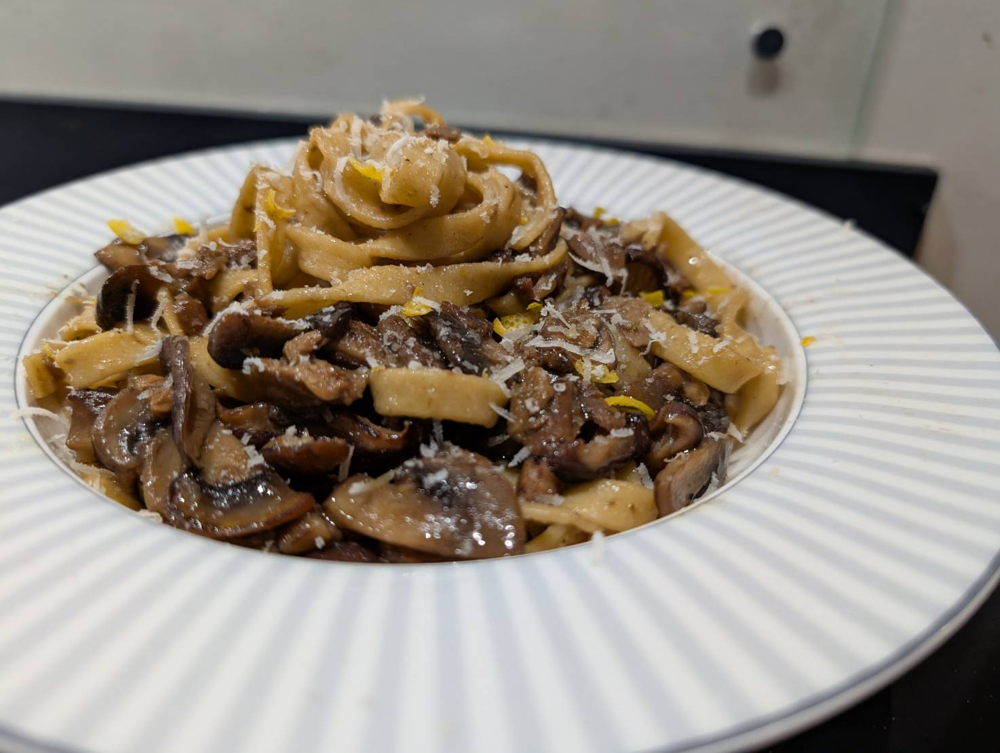
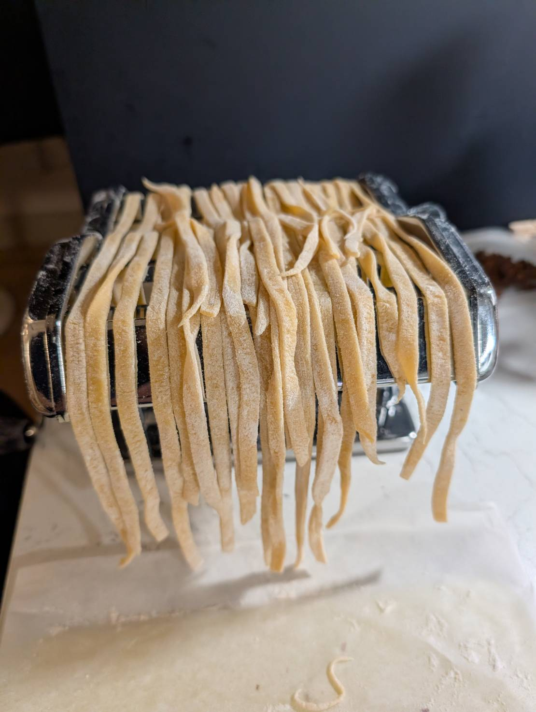

# Cooking

- 🍳 [Recipes](./recipes/index.md)  
- 🍳 [Events](./events/index.md)  

## キノコパスタ
乾燥ポルチーニ・椎茸・マッシュルーム・トリュフオイルとキノコを入れたのだが、思ったより風味が薄かった。
きのこ単体で嚙んでも味が薄かったので、焼いて水分を飛ばせてなかったと思う。
麵も自家製にしたのだがコシが強すぎた。こね過ぎと太すぎが原因だと思う。オリーブオイルの風味も飛んでたのは火にかけてしまったのが原因か。
全体としてはソースが麺に負けていたように思う。

